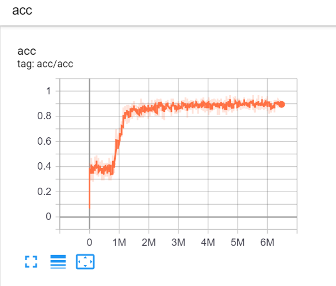
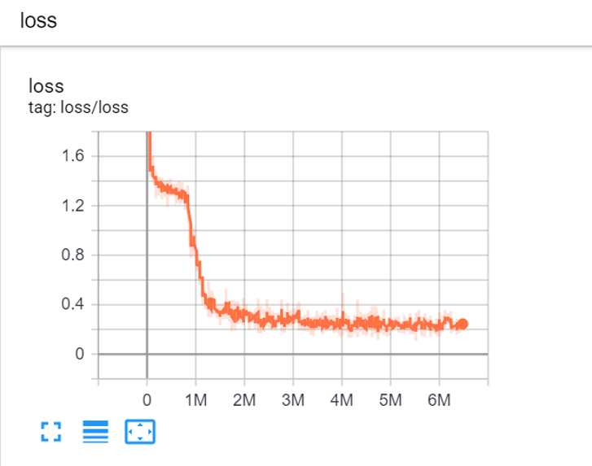

# fast-weights-pytorch
PyTorch Implementation of the paper [Using Fast Weights to Attend to the Recent Past]
Code for generating sequential data is forked from [jiamings/fast-weights](https://github.com/jiamings/fast-weights/tree/master)

## Dependencies
Python >= 3.6
Pytorch
TensorboardX
Numpy
Pickle

## Usage
Generate a dataset

```
$ python generator.py
```

Train the model of fast-weights

```
$ python fast_weights.py
```

## Training Result




### References

[Using Fast Weights to Attend to the Recent Past](https://arxiv.org/abs/1610.06258). Jimmy Ba,  Geoffrey Hinton, Volodymyr Mnih, Joel Z. Leibo, Catalin Ionescu.

[Layer Normalization](https://arxiv.org/abs/1607.06450). Jimmy Ba, Ryan Kiros, Geoffery Hinton.